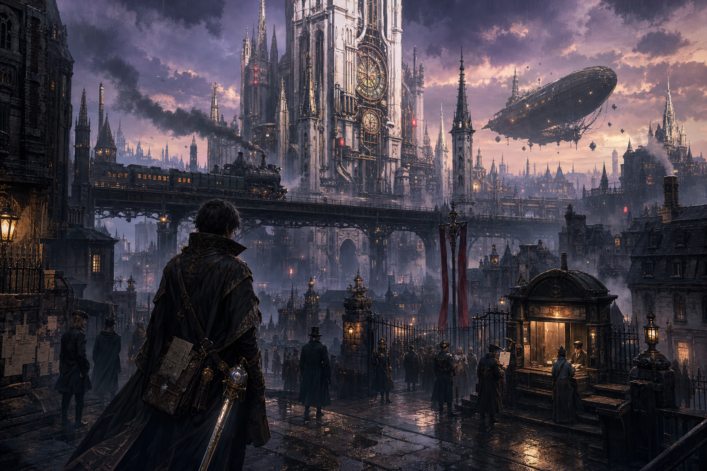
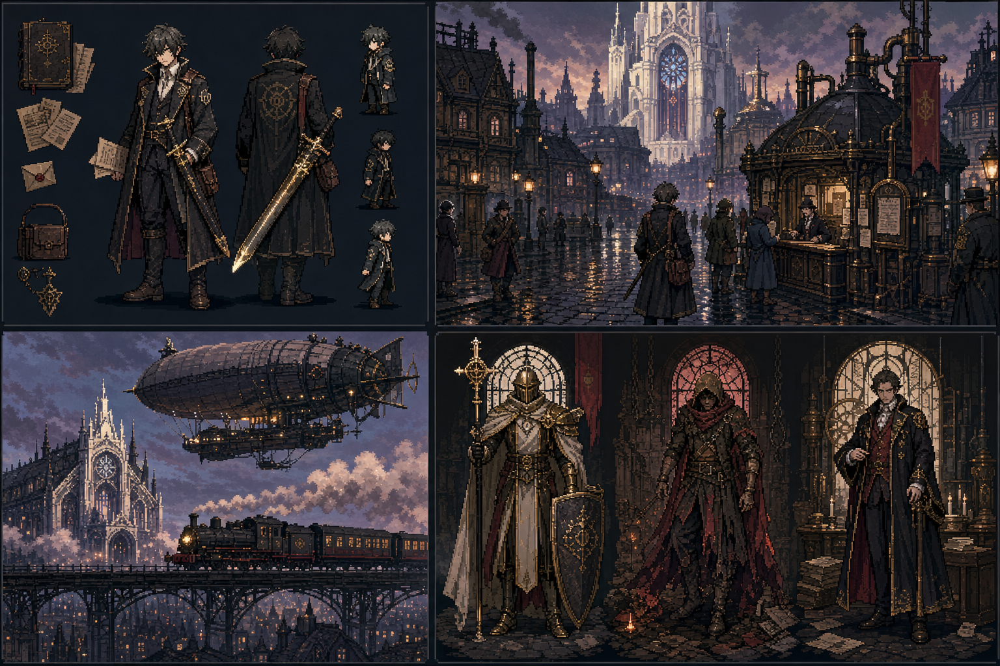

# 美术设计文档

## 1. 美术目标

美术不追求昂贵精细，而要服务主题：

- 玩家一开始相信世界干净、明亮、理性。
- 随着选择推进，画面逐渐暴露秩序背后的裂缝。
- 武力变高后，画面不一定变邪恶，但要变得压迫、庄严、难以反抗。

关键词：

- 童话外壳。
- 政治寓言。
- 清洁秩序。
- 玻璃裂纹。
- 圣洁与支配难分。
- 普通人生活质感。

## 2. 推荐风格

建议采用：

- 2.5D 立体舞台。
- 斜俯视/等距镜头。
- 3D 场景模块 + 像素角色。
- 景深、体积光、局部高光。
- 角色半身立绘。
- 简洁 UI。
- 少量关键插画。

不建议第一阶段做：

- 高帧数角色动画。
- 大量手绘过场。
- 可自由旋转的大型 3D 场景。
- 横版 2D 关卡。
- 全角色 Live2D。

原因：项目核心是系统和叙事，第一阶段美术只需要足够支撑氛围和可读性。

## 3. 画面参考方向

可内部参考以下类型，而不是直接模仿：

- 《八方旅人》式 2.5D 立体舞台感：像素角色、立体场景、景深光影、微缩舞台。
- 经典 JRPG 城镇探索：清晰地图、可读 NPC、明确交互。
- 黑暗童话：表面温柔，细节不安。
- 法庭/教会/议会视觉：秩序、对称、白色、金色、玻璃。
- 独立像素 RPG：用色彩和 UI 表达状态变化。

注意：“HD-2D”更适合作为内部参考词，不建议作为公开宣传标签。对外可描述为“2.5D 像素幻想 RPG”或“斜俯视立体舞台 RPG”。

## 4. 色彩策略

### 初期世界

- 主色：白、浅金、浅蓝、淡绿。
- 感觉：清洁、安稳、公共秩序。

### 真相暴露

- 主色：灰蓝、暗绿、裂纹白、旧铜。
- 感觉：潮湿、压抑、被隐藏。

### 武力升高

- 主色：冷白、深红、黑金、铁灰。
- 感觉：庄严、有效、不可违抗。

### 魔王/圣王暧昧路线

- 不要做成单纯邪恶黑红。
- 应该有神圣感和压迫感并存。
- 让玩家理解为什么普通人会崇拜，也为什么反对者会恐惧。

## 5. 角色设计原则

### 主角

需要至少三阶段：

1. 初始勇者：干净、年轻、带学院感。
2. 裁决勇者：装备更完整，圣剑更明显，表情更坚定。
3. 圣王/魔王分歧：服装更庄严，轮廓更像权力象征。

要求：

- 不要一开始就太成熟。
- 不要一开始就像救世主。
- 外观应允许玩家投射。

### NPC

NPC 设计要体现标签，但不能脸谱化。

例如“穷人农民男性”不能只画成脏乱可怜。他也可能体面、固执、有尊严、有偏见。

每个主要 NPC 立绘应体现：

- 阶层。
- 职业。
- 当下生活状态。
- 是否信任勇者。
- 是否害怕勇者。

## 6. Boss 设计原则

Boss 不一定邪恶，所以视觉不要全做怪物。

三类 Boss：

### 人物 Boss

保留人形和身份特征。重点表现“他为什么被逼到这里”。

### 组织 Boss

可以表现为多人阵列、旗帜、制服、法阵或合体机制。

### 概念 Boss

可以更象征化，例如玻璃镇的幸福幻象、无面陪审团、黄金胃袋。

## 7. 玻璃镇美术需求

### 场景素材

需要：

- 镇中心广场。
- 镇议会大厅。
- 普通居民区。
- 地下裂纹者区域。
- 圣塔入口。
- Boss 战场景。

场景实现目标：

- 使用固定或半固定斜俯视镜头。
- 场景由低成本 3D 模块搭建，角色以像素 Sprite 或低面数角色呈现。
- 建筑、玻璃、圣塔和地下空间通过灯光、阴影、景深表现层次。
- 地图不追求自由旋转，优先保证构图、可读性和交互点清楚。

视觉对比：

- 地上：干净、对称、明亮、玻璃装饰。
- 地下：低矮、潮湿、重复劳动痕迹、被修补的生活用品。

### 角色立绘

Demo 至少需要：

- 主角。
- 法律骑士或临时队友。
- 镇长。
- 裂纹者领袖。
- 共和国监察官。
- 面包师。
- 地下农夫。
- 普通居民代表。
- 白玻璃骑士。

### UI

需要：

- 对话框。
- 选择框。
- 显性数值面板。
- 卡牌对战界面。
- 章节结算界面。

## 8. 第一阶段素材策略

建议分三层：

### 占位素材

来源：Kenney、OpenGameArt、Godot 示例、自己画简单块。  
用途：灰盒原型。

### 临时统一素材

购买或使用一套风格统一的低模场景模块、像素角色包和头像包。  
用途：小范围测试 Demo。

### 定制关键素材

优先定制：

- 主角三阶段。
- 玻璃镇关键 NPC。
- 3 个 Boss。
- 章节结算 UI。

不优先定制：

- 所有路人。
- 所有道具图标。
- 大量战斗动画。

## 9. 给画师的需求格式

每个美术需求应包含：

- 用途：头像、半身、像素角色、3D 场景模块、Boss、UI。
- 尺寸：像素尺寸、画布比例或 3D 模块单位。
- 风格：参考关键词。
- 角色标签：性别、阶层、职业、立场。
- 情绪：默认、恐惧、愤怒、沉默。
- 镜头：默认斜俯视角下的可读性。
- 灯光：是否需要玻璃反射、圣塔光、地下冷光。
- 是否需要分层。
- 是否允许后续改色和裁切。
- 授权范围：游戏内商用、宣传图、Demo、Steam 页面。

## 10. 美术验收标准

- 玩家能一眼区分主要 NPC。
- 地上和地下区域情绪差异明确。
- 2.5D 镜头下交互物、出口、NPC 位置清楚。
- 角色 Sprite 与立体场景不割裂。
- 主角武力升高后的视觉变化能被感知。
- UI 不抢文本阅读。
- 所有素材授权清楚。

## 11. 概念原画归档

以下图片作为当前阶段的视觉探索稿，不代表最终资产。它们的作用是帮助统一气质、构图、材质和世界观关键词，后续进入 Demo 制作时需要再拆分为角色设定、场景设定、UI 参考和可生产资产清单。

### 11.1 哥特蒸汽主视觉

用途：

- 定义 Vesperum 的宏观世界气质：哥特尖塔、白塔监测、蒸汽火车、飞艇、雨夜城市和制度化秩序。
- 建立主角的第一视觉印象：不是传统骑士，而是背负圣剑和档案的调查者。
- 作为宣传主视觉、Steam 页面氛围图、立项展示封面和世界观参考。

可继承要点：

- 白塔应同时具有教堂、监测站和行政中枢的感觉。
- 火车和飞艇代表共和国进入蒸汽现代化时代，但不应让世界变成纯工业朋克。
- 圣剑保持收束和克制，重点不在武器华丽，而在“能越过过程做出最终裁决”的权柄压力。
- 城市需要有明显阶层感：高处是白塔、铁桥和行政设施，低处是拥挤街区、公告、排队窗口和被观察的人群。

需要修正或避免：

- 后续正式资产中不要让主角过于成熟或过于像救世主。
- 不要让画面完全滑向黑暗奇幻；地上世界仍需保留“文明、秩序、进步”的诱惑。
- 宣传图可以宏大，但实际 Demo 画面要优先保证斜俯视探索可读性。

### 11.2 像素风视觉设定表

用途：

- 探索 2.5D 像素 RPG 的可生产方向：角色、街景、交通工具和 Boss 气质。
- 给后续像素角色、场景模块、立绘草图和 Boss 草案提供风格锚点。
- 用于判断“哥特 + 蒸汽时代 + 玻璃镇政治寓言”是否能在像素风下保持辨识度。

可继承要点：

- 主角轮廓应偏调查员：长外套、文件、随身包、低调仪式纹样、未拔出的圣剑。
- 玻璃镇街景应同时呈现湿冷街道、公告窗口、圣塔背景和市民秩序。
- 交通工具可以成为世界观符号：火车代表制度运转，飞艇代表白塔和议会的远程控制。
- Boss 可以保持人形和组织身份，不需要怪物化。白玻璃骑士、地下反抗者、官僚式镇长都应有“不是纯恶”的视觉余地。

需要修正或避免：

- 像素角色后续需要降低细节密度，确保实际游戏尺寸下仍可读。
- Boss 设计要避免一眼邪恶化，尤其不要用过多尖角、血色和恶魔符号偷懒。
- 设定表适合作为方向稿，不能直接当作 Sprite Sheet 使用。
